<h3>Compte Rendu 2ème Avtivité (PRODUIT)<h3>
<h4>1-Creation de l'entité Product</h4>

<h4>2-Configuration fichier application/properties</h4>
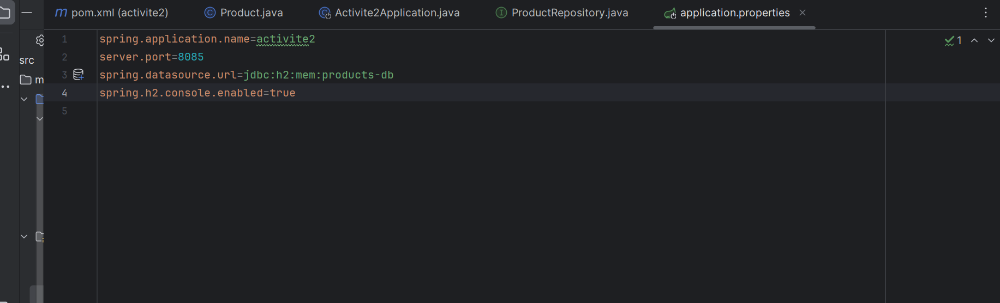
<h4>3-Interface ProductRepository</h4>
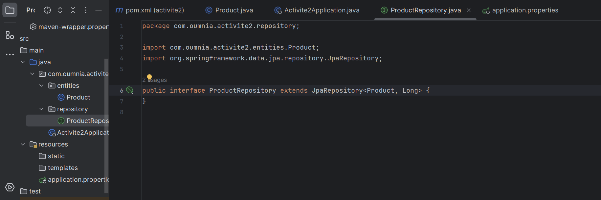
<h4>4-Opérations de gestion de produit</h4>
<h5>-----Ajouter Produit-----</h5>
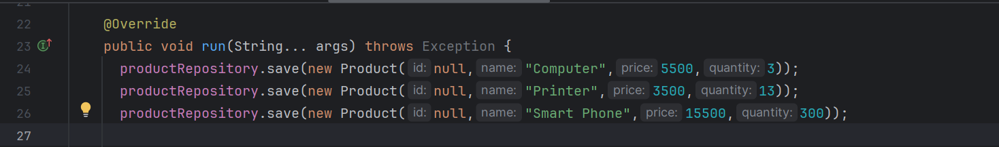
<h5>-----BD-----</h5>
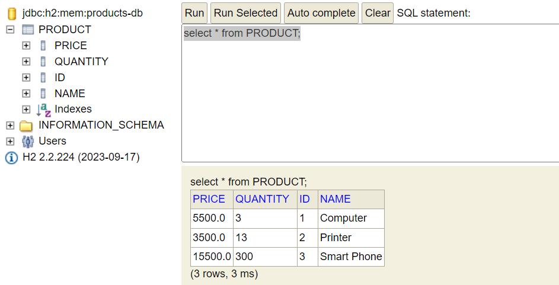
<h5>----Consulter Tous les Produits----</h5>
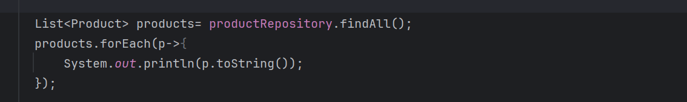
<h5>----Consulter Tous les Produits "CONSOLE"----</h5>
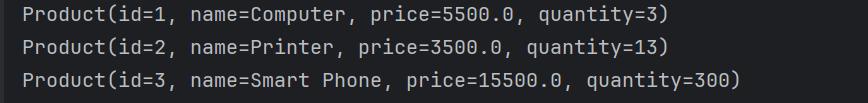
<h5>----Consulter Un Produit Par ID----</h5>
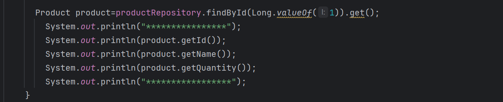
<h5>----Consulter Tous un produit(ID) "CONSOLE"----</h5>
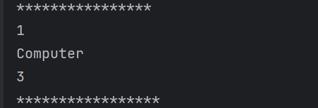
<h5>----Chercher Produit----</h5>
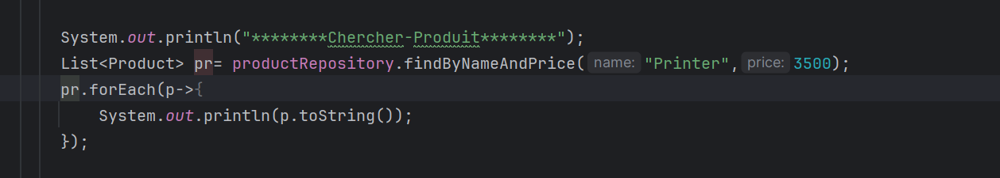
<h5>----Chercher Produit "CONSOLE"----</h5>
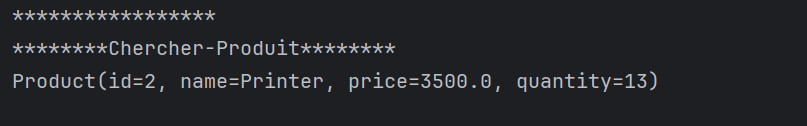
<h5>----Mettre à Jour Produit----</h5>

<h5>----Mettre à Jour Produit "CONSOLE"----</h5>

<h5>----Supprimer Produit----</h5>
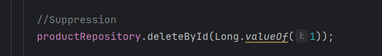
<h5>----Supprimer Produit BD----</h5>
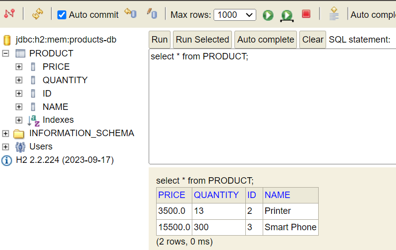
<h4>5-Migration de H2 vers MYSQL</h4>
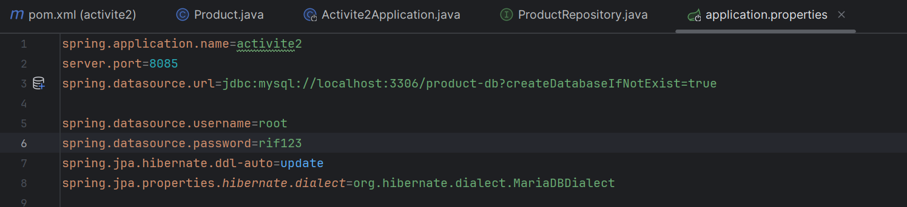
<h4>5-BD MYSQL</h4>
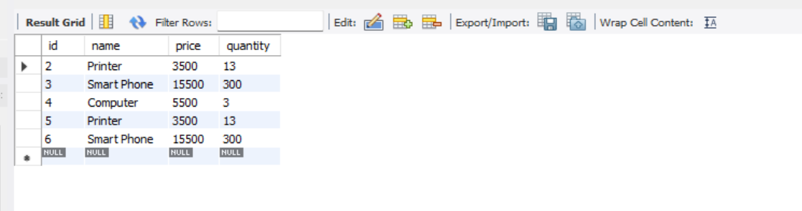
